# Dimensionality Reduction for a Sloan Digital Sky Survey Galaxy Sample

This repository contains my final project for a university Machine Learning course.  
The project explores and compares dimensionality reduction techniques to analyze emission-line galaxy data from the Sloan Digital Sky Survey (SDSS).


## Introduction

Dimensionality reduction helps simplify high-dimensional datasets by reducing the number of features while preserving important structures and patterns.  
In astronomy, galaxy spectra can have many correlated features, making them good candidates for dimensionality reduction before classification or visualization.

The goals of this project were to:
- Apply PCA, t-SNE, and UMAP to galaxy emission line data
- Visualize the data
- Compare methods in terms of clarity of separation between galaxy types


## Repository Structure
```bash
dimensionality-reduction-sdss/
├── data/ # SDSS dataset
├── src/ # Python scripts
├── results/ # generated plots
├── requirements.txt
├── README.md
└── LICENSE
```


## Dataset

The dataset contains emission line flux measurements for galaxies observed by the SDSS.  
Each row corresponds to one galaxy, with the following key flux features: h_beta_flux, h_alpha_flux, oiii_5007_flux, nii_6584_flux, sii_6717_flux, sii_6731_flux, oi_6300_flux, which correspond to intensities of emission lines (with wavelengths given in nanometers included in the feature names) produced by H, Si, Ni and O atoms. Those intensities are correlated with the chemical composition of a given galaxy, and help us to differentiate between galaxies depending on the way they were created.

From these fluxes, we also compute standard **BPT diagram ratios**:
- O3Hb = log([OIII]5007 / Hβ)
- N2Ha = log([NII]6584 / Hα)
- S2Ha = log(([SII]6717 + [SII]6731) / Hα)
- O1Ha = log([OI]6300 / Hα)

## Methods & Results

### **BPT Diagrams**
Baldwin–Phillips–Terlevich (BPT) diagrams are used in astrophysics to distinguish between:
- Emission-Line (EL) galaxies — ionized gas from star formation
- Active Galactic Nuclei (AGN) — ionization from non-thermal sources like black holes

| [NII]/Hα vs [OIII]/Hβ | [SII]/Hα vs [OIII]/Hβ | [OI]/Hα vs [OIII]/Hβ |
|---|---|---|
| 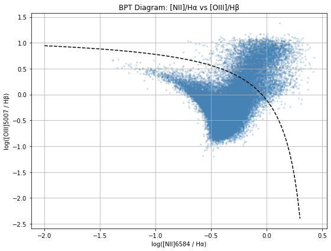 | 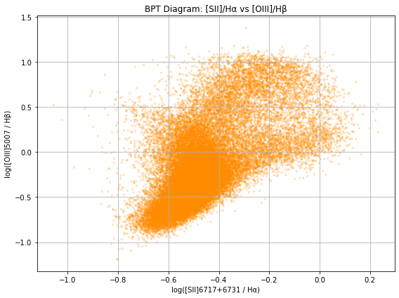 | 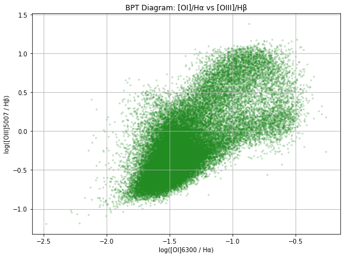 |

The densely populated areas of the plots (below the so-called Kewley line in the first figure) are interpreted as EL galaxies, the sparse points above - as AGN galaxies.  
The goal is to reduce the number of features so that the distinction between the two galaxy types is conserved.

### **PCA**

PCA is a linear dimensionality reduction technique that transforms the original variables into a set of uncorrelated variables called principal components. Each component is a weighted combination of the original features and is ordered so that the first few components explain most of the variance in the data.

**Results:**
- PC1 explains the majority of the variance (>90%), along with PC2 and PC3 they account for approximately 100% of the variance.

| PCA variance | PCA new components |
|---|---|
| 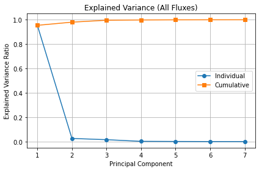 | 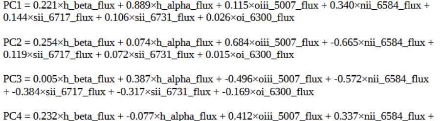 |

- We observe sparse points in both 2D and 3D projection. After zooming in, one of the points actually turns out to be a whole cluster of points, dense in one region, surrounded by a spread of outliers.
- PCA preserves global structure - the dense cluster is most likely the EL galaxies, the outliers correspond to the AGNs.

| PCA 2D Projection | PCA 3D Projection | PCA 2D Projection zoom-in |
|---|---|---|
| 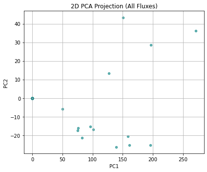 | 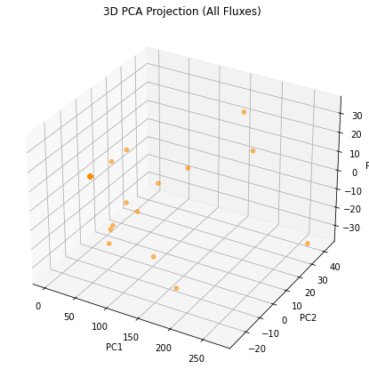 | 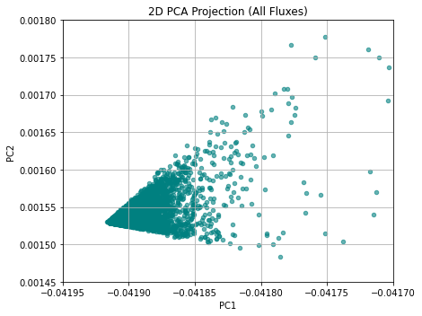 |


### **t-SNE**
Non-linear projection emphasizing local structures.

| PCA 2D Projection | PCA 3D Projection |
|---|---|
| 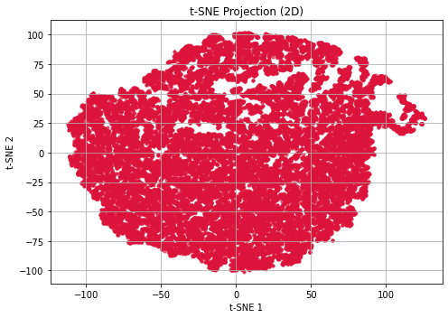 | 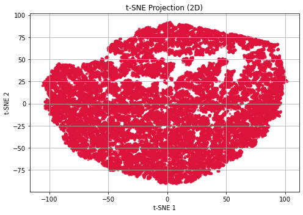 |


---

### **UMAP**
Preserves local & global structures efficiently.

| UMAP 2D | UMAP 3D |
|---|---|
| 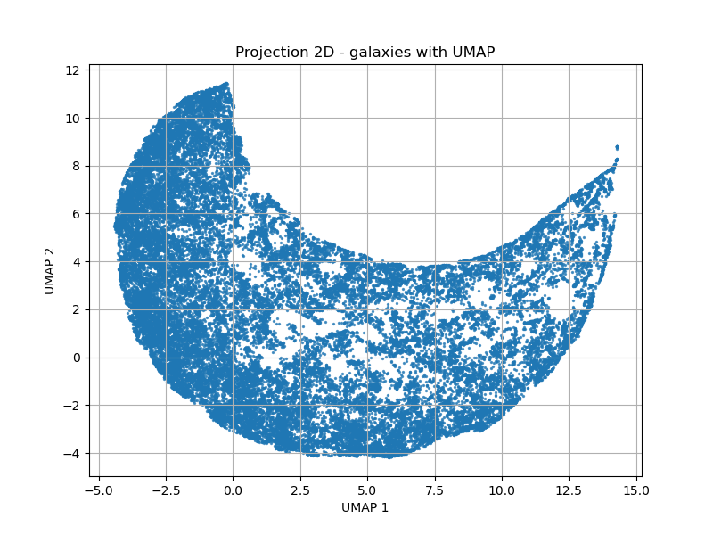 | 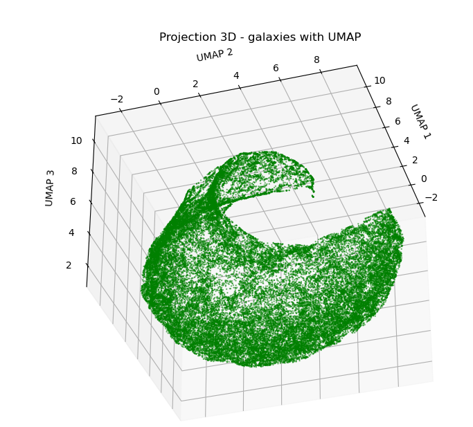 |

---

